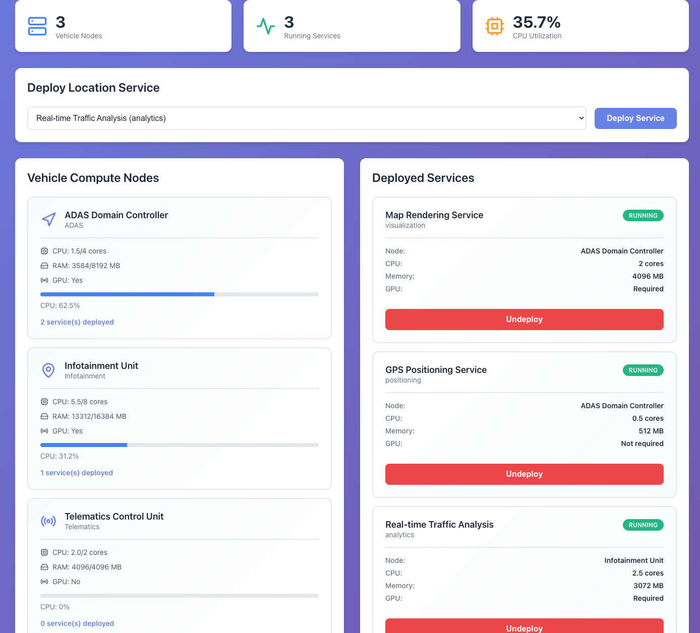

# 📦 GitHub Deployment Checklist

Use this checklist to push your project to GitHub once you're happy with the local demo.

## ✅ Pre-Push Checklist

### 1. Test Everything Locally
- [ ] Backend starts without errors (`python app.py`)
- [ ] Frontend starts without errors (`npm start`)
- [ ] Can deploy all 5 service types
- [ ] Can undeploy services
- [ ] CPU bars update correctly
- [ ] No console errors in browser (F12)

### 2. Clean Up Project
- [ ] Remove any test files or personal data
- [ ] Check for API keys or secrets (none in this project, but good practice)
- [ ] Ensure `.gitignore` is in place
- [ ] Delete `node_modules/` if committed accidentally

### 3. Prepare Documentation
- [ ] Update your name/email in all docs
- [ ] Add screenshot or GIF to README
- [ ] Verify all links work
- [ ] Update GitHub username placeholders

---

## 🚀 Step-by-Step GitHub Push

### Step 1: Create GitHub Repository

1. Go to https://github.com/new
2. Repository name: `sdv-service-orchestrator`
3. Description: `Software Defined Vehicle service orchestration with intelligent bin-packing scheduler`
4. Public or Private: **Public** (for portfolio)
5. **DO NOT** initialize with README (we have one)
6. Click "Create repository"

### Step 2: Initialize Git Locally

Open terminal in your `sdv-service-orchestrator` folder:

```bash
# Initialize git (if not already done)
git init

# Add all files
git add .

# Check what will be committed
git status

# Make first commit
git commit -m "Initial commit: SDV Service Orchestrator with bin-packing scheduler"
```

### Step 3: Connect to GitHub

```bash
# Add remote (replace YOUR_USERNAME with your GitHub username)
git remote add origin https://github.com/YOUR_USERNAME/sdv-service-orchestrator.git

# Verify remote was added
git remote -v

# Push to GitHub
git branch -M main
git push -u origin main
```

**Enter your GitHub credentials when prompted.**

### Step 4: Verify Upload

1. Refresh your GitHub repository page
2. You should see all files uploaded
3. README.md should display automatically
4. Check that `.gitignore` worked (no `node_modules/` or `__pycache__/`)

---

## 📸 Adding Screenshots/GIF

### Option 1: Quick Screenshot

1. Run the app locally
2. Take a screenshot (Cmd+Shift+4 on Mac, Win+Shift+S on Windows)
3. Upload to GitHub:
   - Go to your repo
   - Click "Add file" → "Upload files"
   - Upload screenshot as `demo-screenshot.png`
   - Update README.md line with screenshot:
     ```markdown
     
     ```

### Option 2: Animated GIF (Recommended)

**Using Free Tools:**

**Mac:**
- Install **Kap** (free): https://getkap.co/
- Record 30-second demo
- Export as GIF
- Upload to repo

**Windows:**
- Use **ScreenToGif** (free): https://www.screentogif.com/
- Record demo
- Export as GIF
- Upload to repo

**Any OS:**
- Record video with OBS Studio
- Convert to GIF with https://ezgif.com/video-to-gif

**What to show in GIF (30 seconds):**
1. Dashboard with 3 nodes (2 seconds)
2. Deploy "Map Rendering" service (5 seconds)
3. Show it appearing in services list (3 seconds)
4. Deploy 2-3 more services quickly (5 seconds)
5. Show CPU bars filling up (5 seconds)
6. Undeploy a service (5 seconds)
7. End on clean dashboard (5 seconds)

### Option 3: Video Demo

Record a 2-3 minute walkthrough and upload to YouTube:

1. Record with Loom (https://loom.com) or OBS Studio
2. Upload to YouTube (unlisted or public)
3. Add link to README:
   ```markdown
   ## 🎥 Video Demo
   
   [](https://www.youtube.com/watch?v=VIDEO_ID)
   ```

---

## 🎨 GitHub Profile Enhancement

### Add to Profile README

If you have a GitHub profile README, add this project:

```markdown
### 🚗 SDV Service Orchestrator
A production-ready demonstration of vehicle software orchestration with intelligent bin-packing scheduler. Built with Python (Flask) and React.

[View Project](https://github.com/YOUR_USERNAME/sdv-service-orchestrator) | [Live Demo](YOUR_DEPLOYMENT_URL)
```

### Pin Repository

1. Go to your GitHub profile
2. Click "Customize your pins"
3. Select this repository
4. It will appear at the top of your profile

---

## 🏷️ GitHub Repository Settings

### Topics (Tags)

Add these topics to your repository for discoverability:

```
sdv, automotive, vehicle-software, orchestration, bin-packing, 
python, flask, react, microservices, scheduler, adas, 
location-services, portfolio, interview-prep
```

To add:
1. Go to repo settings
2. Scroll to "Topics"
3. Add the above topics

### Repository Description

```
SDV service orchestrator with intelligent bin-packing scheduler for location services. Python/Flask backend + React frontend. Portfolio-ready demo.
```

### Website Link

Add your portfolio link: `https://prasadkavuri.com`

---

## 🌐 Optional: Deploy Online

### Option 1: Render.com (Free, Easy)

**Backend:**
1. Go to https://render.com
2. New → Web Service
3. Connect GitHub repo
4. Build command: `pip install -r requirements.txt`
5. Start command: `python app.py`
6. Click "Create Web Service"

**Frontend:**
1. New → Static Site
2. Build command: `npm install && npm run build`
3. Publish directory: `build`
4. Environment variable: `REACT_APP_API_URL=https://your-backend-url.onrender.com`

### Option 2: Railway.app (Free)

1. Go to https://railway.app
2. New Project → Deploy from GitHub
3. Select your repo
4. Railway auto-detects Python + Node
5. Sets up both services automatically

### Option 3: Vercel (Frontend) + Render (Backend)

**Frontend on Vercel:**
```bash
cd frontend
npm install -g vercel
vercel
```

**Backend on Render** (same as Option 1)

---

## 📝 Update README with Live Links

Once deployed, update your README:

```markdown
## 🌐 Live Demo

🔗 **[Try it live!](https://your-deployment-url.com)**

Backend API: https://your-backend.onrender.com
```

---

## 🎯 Post-Deployment Checklist

- [ ] Repository is public
- [ ] README displays correctly
- [ ] Screenshots/GIF added
- [ ] Topics/tags added
- [ ] Repository description set
- [ ] Repository pinned to profile
- [ ] All links work
- [ ] Code is well-documented
- [ ] License file present (MIT)

---

## 📊 GitHub Stats (After Upload)

Your repo will show:
- **Languages:** Python (60%), JavaScript (35%), CSS (5%)
- **Size:** ~500 KB (with node_modules excluded)
- **Files:** ~20 files
- **Commits:** Starting with your initial commit

---

## 🎤 Sharing Your Project

### LinkedIn Post Template

```
🚗 Excited to share my latest project: SDV Service Orchestrator!

Built a production-ready demo of how modern vehicles manage location services across distributed compute nodes using intelligent bin-packing algorithms.

🔧 Tech Stack: Python (Flask) + React + REST API
📊 Features: Real-time monitoring, resource-aware scheduling, heterogeneous compute management

This project showcases:
✅ Full-stack development
✅ Algorithm implementation (bin-packing)
✅ System design (microservices)
✅ Automotive software concepts (ADAS, Infotainment, Telematics)

Check it out: [GitHub link]

#SoftwareEngineering #AutomotiveSoftware #SDV #Python #React #FullStack
```

### Twitter/X Post Template

```
Just built an SDV Service Orchestrator with intelligent bin-packing! 🚗⚡

Demonstrates how modern vehicles manage location services across distributed ECUs.

Python + React + Real-time monitoring

[GitHub link]

#SDV #AutomotiveSoftware #Python #React
```

---

## 🐛 Common GitHub Issues

### Issue: "node_modules/ uploaded"

```bash
# If node_modules got committed
git rm -r --cached frontend/node_modules
git commit -m "Remove node_modules from tracking"
git push
```

### Issue: "Files too large"

```bash
# GitHub has 100MB file limit
# Check large files
git ls-files | xargs ls -l | sort -nrk5 | head -10

# Remove large file from git history
git filter-branch --tree-filter 'rm -f path/to/large/file' HEAD
```

### Issue: "Merge conflicts"

```bash
# If you edited files on GitHub directly
git pull origin main
# Resolve conflicts in editor
git add .
git commit -m "Resolve merge conflicts"
git push
```

---

## ✅ You're Done!

Your project is now:
- ✅ Version controlled with Git
- ✅ Hosted on GitHub
- ✅ Documented with screenshots
- ✅ Tagged for discoverability
- ✅ Ready for sharing
- ✅ Portfolio-ready

**Next:** Add to your resume, share on LinkedIn, include in job applications!

---

## 📞 Need Help?

- **Git Issues:** https://docs.github.com/en/get-started
- **GitHub Pages:** https://pages.github.com/
- **Deployment:** Check DEPLOYMENT_GUIDE.md

Good luck! 🚀
